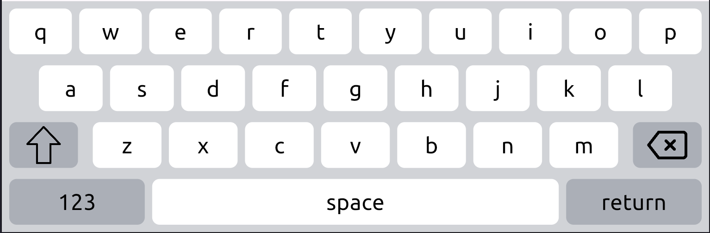
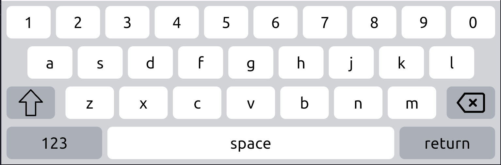
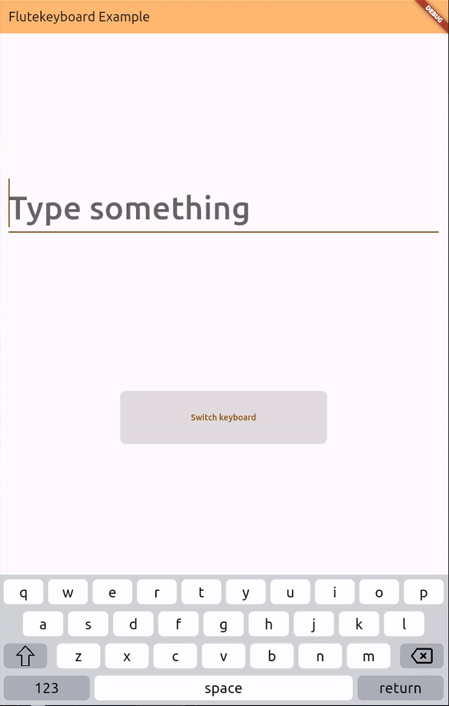

# Flutekeyboard – Customizable, Multi-Language On-Screen Keyboard

## ✨ Features

- **Alphanumeric and numeric keyboards**
- **Fully customizable UI**
  - Colors
  - Text styles
  - Icons
- **Multi-language layout support**
  - English
  - Italian
  - German
  - French
  - Spanish
  - Portuguese
  - Polish
  - Dutch
  - Czech
  - More to come
- **Symbol pages** (e.g., punctuation, special characters)
- **Custom layout support** – define your own key arrangements
- **Alternative key support** – long-press secondary keys

## 📦 Installation

In the `pubspec.yaml` of your flutter project, add the following dependency:

```yaml
dependencies:
  ...
  flutekeyboard: ^latest_version
```

or

```yaml
dependencies:
  ...
  flutekeyboard:
    git:
      url: https://github.com/amarula/flutekeyboard.git
      ref: main
```

To use the keyboard widget import it:

```dart
import 'package:flutekeyboard/flutekeyboard.dart';
```

To create custom layout import:

```dart
import 'package:flutekeyboard/flutekeyboard_keys.dart';
```

## 🚀 Usage

### Basic Alphanumeric Keyboard

```dart
    Expanded(
      child: FluteKeyboard(
        width: 800,
        type: FluteKeyboardType.alphanumeric,
        textController: _textController,
        backgroundColor: const Color.fromARGB(255, 209, 211, 215),
        btnBackgroundColor: const Color.fromARGB(255, 255, 255, 255),
        btnSpecialBackgroundColor:
            const Color.fromARGB(255, 171, 175, 183),
        backspaceIcon: 'assets/backspace.png',
        btnTextStyle: const TextStyle(
                  color: Colors.black,
                  fontSize: 28,
                ),
        shiftIcon: 'assets/shift.png',
        shiftActiveIcon: 'assets/shift_active.png',
      ),
    ),
```



### Custom Alphanumeric Layout

```dart
import 'package:flutekeyboard/flutekeyboard_keys.dart';

class CustomLayout {
  static const List<List> layout = [
    [
      '1',
      '2',
      '3',
      '4',
      '5',
      '6',
      '7',
      '8',
      '9',
      '0',
    ],
    [
      'a',
      's',
      'd',
      'f',
      'g',
      'h',
      'j',
      'k',
      'l',
    ],
    [
      IconKeys.shift,
      'z',
      'x',
      'c',
      'v',
      'b',
      'n',
      'm',
      IconKeys.backspace,
    ],
    [
      SpecialKeys.symbol1,
      SpecialKeys.space,
      SpecialKeys.returnK,
    ],
  ];
}
```



## Screenshots

<p align="center">
  
</p>